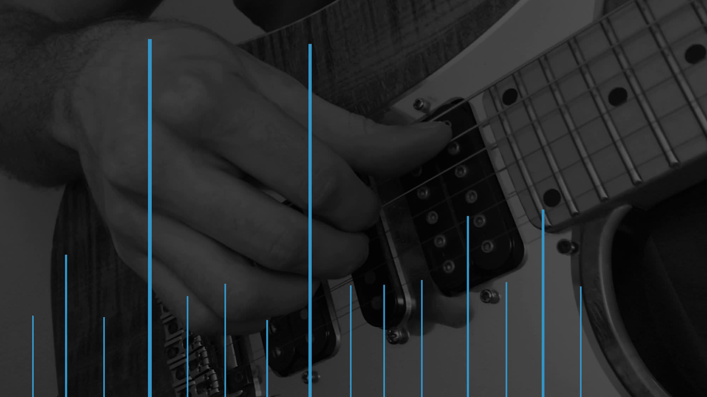

# Delay without the delay

A prototype interface programming synthesizer envelopes using audio signals (e.g. your voice). Please read the full [write-up](http://arthurcarabott.com/mui-delay/)

**Warning:** This is prototype code, it is not production code. It is not particularly user friendly, has not been cleaned up, and has not been factored. You have been warned.

## Requirements

[SuperCollider](http://supercollider.github.io/)

## Running

Run the block labelled `Run this code first` then run the first line `~main.()`

At the bottom of the file there are some MIDIdefs which can be adjusted for your MIDI controller, and some variables that can be toggled to switch between different settings.

Using the blocks `enable onsets` and `disable onsets` you can choose whether audio input is enabled or disabled. When disabled you can use MIDI note input instead. Alternatively use MIDI `program` value `2`.

`~stopRecording` and `~clearDelays` will do what they say. They are assigned to MIDI `program` values `0` and `3` respectively.

`~playWithTap` toggles between playing a synth note on each detected tap. Not advised if using audio input without headphones (which is not really advised anyway).

`~comb` toggles between using a single tap delay, and a comb filter. Alternatively use MIDI `program 1`.

`~normalize` toggles between normalizing the amplitude of delay taps. This is useful for audio input, less so for MIDI.

`~minMul` and `~maxMul` determine the volume range when normalizing.

`~delayGroup` is the audio group with all of the delays, you can set the amount of decay when `~comb` is `true`, and the `mul` (volume) of all taps.
