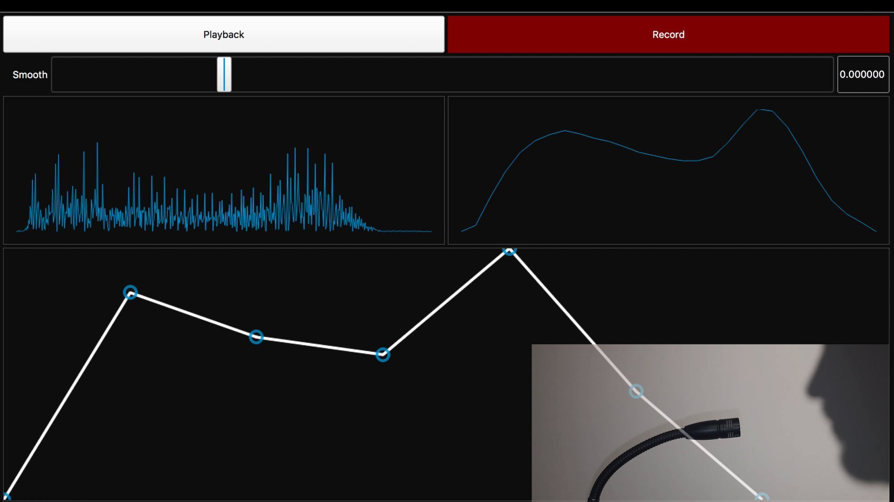

# Envelopes by Example

A prototype interface programming synthesizer envelopes using audio signals (e.g. your voice). Please read the full [write-up](http://arthurcarabott.com/mui-envelope/)

**Warning:** This is prototype code, it is not production code.

## Requirements

[SuperCollider](http://supercollider.github.io/)

## Installation

Either copy or symlink the `classes` directory to your SuperCollider extension directory. You can find this by running `Platform.userExtensionDir` in SuperCollider. Re-compile the library if SuperCollider was already running.

You don't need to be familiar with SuperCollider to run this prototype, but it may help! You can find an introductory courser [here](https://github.com/acarabott/sc-resonate)

## Running

You should be able to select and run all code in `envelopes-by-example.scd`. There are some `MIDIdef`s at the bottom which can be modified for your controller.

Use the `Playback/Input` button to switch between Playback mode (after you've programmed the envelope) and Input mode (which arms the system, ready to record).

Press *and hold* the `Record` button to record your envelope, release to stop recording. If you have a MIDI controller connected, playing/holding/releaseing a MIDI note will do the same thing if in Input mode.

### Adjustments

Use the `Smooth` slider to adjust the amount of initial filtering of the signal.

Press the `Show Variations` button and slider to change the number of 'handles' on the envelope. The level of the blue handles can be adjusted. The timing cannot be adjusted, but if you build this for real, you should add this feature.

## Credit

The code in `HandleFinder` was ported from a [Squeak](http://squeak.org/) implementation by [Yoshiki Ohshima](https://harc.ycr.org/member/yoshiki_ohshima/) at [HARC](https://harc.ycr.org/)
