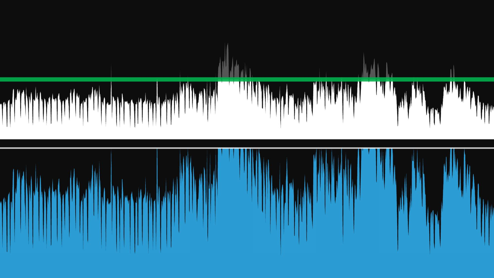

# Opening the tiny window

A prototype interface for audio dynamic range tools, please read the full [write-up](http://arthurcarabott.com/mui-dynamic-range/)

This is prototype code, it is not production code. It uses a game loop model to simplify rendering, it is definitely using more cycles than it could be.

The main "trick" of the prototype is to use the same `Effect` code to process the OpenGL vertices as the audio floats. This keeps the graphics representative, as well as nice and snappy (as it processes far fewer vertices than audio samples).

## Installation

### Requirements

- GLFW
- libsndfile
- libao
- OpenGL framework (included in macOS)
- Accelerate framework (included in macOS)

Using [Homebrew](https://brew.sh/) you can install this by running this in a terminal:

`brew install glfw libsndfile libao`

The use of the Accelerate framework means this is macOS only. These bits could be re-written, but they won't be (by me at least!).

### Building

Just run `./run.sh` to build and run. If you just want to build use `./comp.sh`

